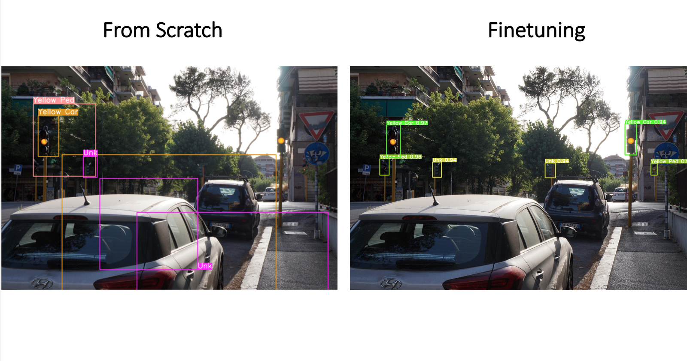
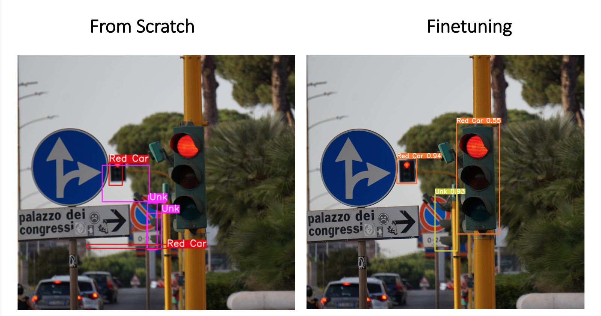

# Traffic Light Detection - TLD
Autonomous driving is increasingly becoming a reality common to all of us thanks to the continuous and rapid development of Artificial Intelligence. A fundamental role underlying this technology is played by sensors, cameras and the digital processing of the captured signals. Obviously, the reliability of these systems must be the key element for optimal and safe operation of the device.

In this project a **traffic light detector** will be implemented. After the detection a classification on the type and color of the light will be done. Finally the network will be able to detect and distinguish 7 different classes of traffic lights: red, green, yellow lights for both cars and pedestrian  and finally the 'unknown' class (for all the traffic lights that are identifiable but we cannot see their color). 

My work was about the compairson between a from stratch Faster RCNN model and a Yolo V5 finetuned on my dataset. Here I report some of the final results. 

<table>
  <tr>
    <td>
    <td>
  </tr>
  <tr>
    <td>
    <td>
  </tr>
 </table>

## About the repository
In this repository I reported all the codes I used to build and train the Faster RCNN model and for the Yolo V5 fine tuning. All the functions are written according to the PyTorch framework. 

Due to limited computational resourses of my laptop I used the Colab Notebook for training and evaluation phase. All the notebooks can be found in the *Colab_Notebooks* folder. 

## Base Idea
The very first intuition is the one adopted in the FasterRCNN algorithm which is a lighter and faster version of Fast RCNN. This faster system should be great since it will allow us to use it in embedding systems. A possible approach to the algorithm I will implement is the following:
- **Feature extraction**: a CNN will be used to extract the main features of the image. 
- **Region of Interest**: Once we have our feature maps, we want to implement an algorithm which will find possible regions of interest (RoI).
- **RoI pooling**: to bring all the regions of the same size.
- **Classification**: we will finally use a fully connected network to classify the objects in the bounding boxes.
- **Regression**: to improve the bounding boxes regions.

To compare the Faster RCNN model with a newest one, I also decided to do a finetuning of a Yolo V5 algorithm. 

## Dataset
The dataset I will use was collected by myself, taking pictures of traffic lights all over my city using a high resolution camera. The images were then appropriately cropped and annotated through the ** RoboFlow ** framework. The final augmented dataset consists of:
- 144 training images
- 35 validation images
- 25 test images
